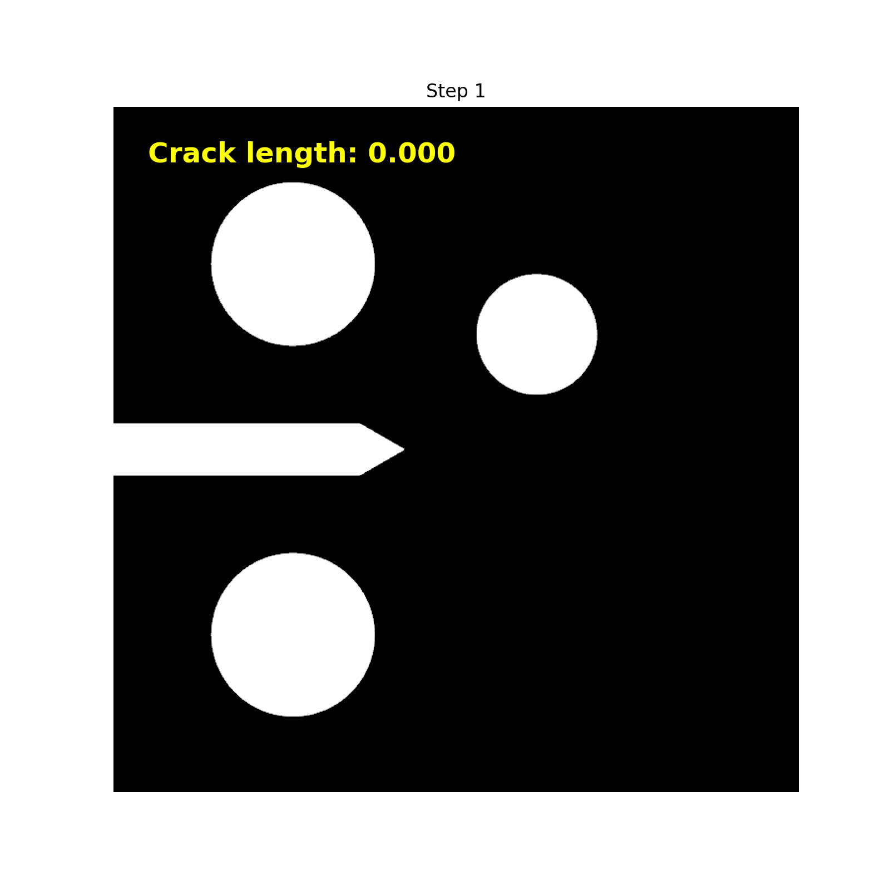

Crack Measurements
==================

Once the simulations are completed, the next step is to analyze the results by extracting and interpreting various measurements related to crack propagation and material behavior. This section outlines the key measurements obtained from the simulation results. It is important to note that measuring the crack area directly through the $\gamma(\phi)$ term tends to overestimate the actual crack area. Therefore, an automatic procedure for measuring the crack area is proposed here. This is an adaptation based on the work of :footcite:t:`code_skeleton_algorithm`.

The phase-field variable $\phi$ is stored in the output files in ".vtu" format for each simulation step. If the simulation consists of $number\_steps$ time steps, the procedure is as follows:

1. The crack is identified in regions where the phase-field variable $\phi$ exceeds a threshold value, defined as $\phi_{th} = 0.95$.

   Crack evolution over time (animated GIF).

2. Using this threshold, the crack area is extracted from the phase-field variable $\phi$. An image is then generated, highlighting regions where $\phi > \phi_{th}$ in one color and regions where $\phi < \phi_{th}$ in another.

   .. note::
      For the examples considered here, a rectangular domain is used. Therefore, the generated image will be a rectangle with the same size as the simulation domain. This allows for a direct mapping between image pixels and the physical dimensions of the domain, enabling accurate determination of the real coordinates of the crack in the images.

3. The skeleton of the crack is then extracted from the image. Skeletonization reduces the crack region to a single-pixel-wide path, representing the crack trajectory. This is accomplished using the `skimage.morphology.skeletonize` function and is performed for all time steps of the simulation. The underlying algorithm for skeletonization is explained in detail in the `scikit-image documentation <https://scikit-image.org/docs/0.25.x/auto_examples/edges/plot_skeleton.html>`_.
4. Since pixel-based measurements can introduce errors—especially where the crack path is diagonal or curved—the skeleton points are treated as coordinates, and a curve is fitted through these points to better approximate the actual crack path.
5. Finally, the length of the fitted curve is measured to obtain an accurate estimate of the crack length.

.. figure:: crack_evolution_pyvista.gif
   :align: center
   :width: 400

   Crack evolution over time (animated GIF).

.. footbibliography::